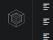
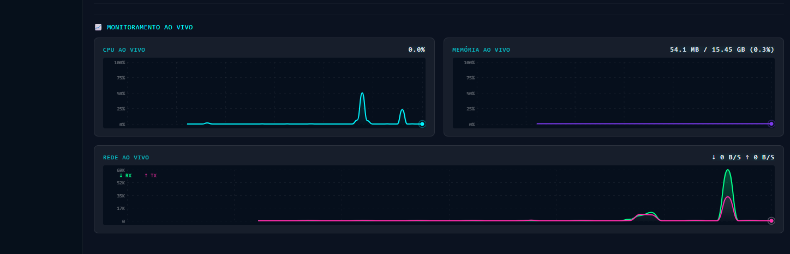

# Container Manager — Extensão VS Code

[](https://img.shields.io/visual-studio-marketplace/v/fean-developer.fean-container-manager?style=flat-square&label=Visual%20Studio%20Marketplace)
[](https://flat.badgen.net/github/release/fean-developer/fean-container-manager)
[](LICENSE)

Gerencie containers, imagens, volumes e redes Docker diretamente na sua IDE, sem precisar sair do VS Code.


---

## Funcionalidades

- **Dashboard** com resumo do ambiente Docker: versão do Engine, OS, CPUs, memória e contadores de recursos
- **Abertura automática do Dashboard** ao clicar no ícone da Activity Bar — sem precisar navegar na sidebar
- **Lista de containers** com checkboxes, ações em lote (Start, Stop, Kill, Restart, Pause, Resume, Remove), busca em tempo real e ordenação por coluna
- **Sidebar interativa** com árvore de Containers, Imagens, Volumes e Redes
- **Botões de ação inline** na árvore: Start/Stop/Restart/Remove para containers; Remove para imagens e volumes
- **Atualização automática** a cada 10 segundos
- **Gerenciamento de containers**: iniciar, parar, reiniciar, matar (SIGKILL), pausar, retomar e remover
- **Logs inline** na aba Geral com **auto-atualização configurável** (2s, 5s, 10s, 30s, 1 min) e atualização sem flicker
- **Terminal integrado** com exec direto no container (compatível com WSL)
- **Monitoramento em tempo real via streaming**: gráficos de CPU %, Memória % e Rede RX/TX com rótulos no eixo Y, histórico de 60 pontos a 1s de intervalo
- **Webview de detalhes** com 5 abas: Geral, Logs, Portas, Variáveis de Ambiente e Inspect JSON
- **Botões de ação no detalhe**: Start, Stop, Restart e Remover com feedback visual
- **Remoção em lote** de imagens e volumes com confirmação obrigatória

---

## Pré-requisitos

- VS Code 1.85 ou superior
- Docker Engine instalado e em execução na máquina local
- Usuário com acesso ao socket Docker (`/var/run/docker.sock` no Linux/macOS)

### Linux — Conceder acesso ao socket Docker sem sudo

```bash
sudo usermod -aG docker $USER
# Faça logout e login novamente para aplicar
```

---

## Como usar

Após a instalação, o ícone do Container Manager aparece na Activity Bar (barra lateral esquerda).



> **Dica:** Ao clicar no ícone do Container Manager na Activity Bar, o **Dashboard abre automaticamente** e a sidebar é fechada para maximizar o espaço de trabalho.

### Dashboard

O Dashboard abre automaticamente ao clicar no ícone na Activity Bar.

| Informação | Descrição |
|---|---|
| Node Info | Hostname, versão do Docker, OS, arquitetura, CPUs e memória total |
| Containers | Total, em execução e parados |
| Imagens | Quantidade e tamanho total em disco |
| Volumes | Quantidade total |
| Redes | Quantidade total |


### Lista de Containers (visão Portainer)


Clique no ícone `$(list-unordered)` na toolbar da sidebar para abrir a **Lista de Containers**.

| Recurso | Descrição |
|---|---|
| Checkboxes | Selecione um ou vários containers para ação em lote |
| Toolbar de ações | Start, Stop, Kill, Restart, Pause, Resume, Remove aplicados a todos selecionados |
| Busca | Filtra por nome, imagem ou estado em tempo real |
| Ordenação | Clique em qualquer cabeçalho de coluna para ordenar |
| Quick Actions | Ícones por linha: Ver Logs, Inspecionar, Abrir Terminal |
| Portas | Portas publicadas são links clicáveis |

### Containers (sidebar)

| Ação | Como fazer |
|---|---|
| Ver containers | Expanda o grupo **Containers** na sidebar |
| Iniciar | Botão inline ▶ ou clique direito → **Iniciar Container** |
| Parar | Botão inline ■ ou clique direito → **Parar Container** |
| Reiniciar | Botão inline ↻ ou clique direito → **Reiniciar Container** |
| Ver logs | Clique direito → **Ver Logs** |
| Abrir terminal | Clique direito → **Abrir Terminal no Container** |
| Inspecionar / Detalhes | Clique no container |
| Remover | Botão inline 🗑 ou clique direito → **Remover Container** *(confirmação obrigatória)* |

### Webview de Detalhes do Container

Aberto via **Inspecionar Container**, exibe 5 abas:

| Aba | Conteúdo |
|---|---|
| **Geral** | Informações do container (ID, imagem, estado, rede, política de restart) + **gráficos de monitoramento em tempo real** (CPU %, Memória %, Rede RX/TX) |
| **Logs** | Logs do container com **auto-atualização** configurável (Desativado / 2s / 5s / 10s / 30s / 1min) sem flicker |
| **Portas** | Mapeamento de portas internas → públicas |
| **Variáveis de Ambiente** | Todas as env vars do container |
| **Inspect JSON** | JSON completo retornado pelo `docker inspect` |


**Botões de ação**: Start, Stop, Restart e Remover — estado atualizado automaticamente conforme o container.

#### Monitoramento em Tempo Real (aba Geral)

Os gráficos usam **streaming contínuo** da Docker Engine API (`stream: true`), garantindo valores precisos de CPU mesmo no Docker Desktop e WSL2 (sem valores zerados por cache).

| Gráfico | Detalhe |
|---|---|
| CPU % | Percentual de uso com base nos ciclos de CPU disponíveis; escala automática |
| Memória % | Uso real (excluindo page cache); escala automática |
| Rede RX/TX | Tráfego de entrada e saída com unidade automática (B / KB / MB) |



- Intervalo de atualização: **1 segundo**
- Histórico exibido: **60 pontos** (último 1 minuto)
- Rótulos no eixo Y para leitura imediata dos valores

### Imagens


| Ação | Como fazer |
|---|---|
| Ver imagens | Expanda o grupo **Imagens** |
| Remover imagem | Botão inline 🗑 ou clique direito → **Remover Imagem** *(confirmação obrigatória)* |
| Limpar não utilizadas | Clique direito → **Remover Imagens Não Utilizadas** |

### Volumes

| Ação | Como fazer |
|---|---|
| Ver volumes | Expanda o grupo **Volumes** |
| Remover volume | Botão inline 🗑 ou clique direito → **Remover Volume** *(confirmação obrigatória)* |
| Limpar não utilizados | Clique direito → **Remover Volumes Não Utilizados** |

---

## Segurança

> **Atenção:** O acesso ao socket Docker é equivalente a acesso root no host.

Esta extensão adota as seguintes medidas de segurança:

- **Acesso somente local**: conexão exclusiva via Unix socket (`/var/run/docker.sock`) ou named pipe no Windows. Nenhuma conexão de rede é aberta.
- **Sem servidor HTTP**: a extensão não expõe nenhuma porta ou serviço de rede.
- **Sem log de dados sensíveis**: variáveis de ambiente e configurações de container não são logadas.
- **Confirmação obrigatória** para todas as ações destrutivas (remover container, imagem, volume, kill em lote).
- **Content Security Policy (CSP)** rígida nos Webviews: apenas scripts com nonce são permitidos; nenhum recurso externo é carregado.
- **Webview com `localResourceRoots` restrito**: apenas o diretório `resources/` da extensão pode ser acessado.

### Riscos conhecidos

| Risco | Mitigação |
|---|---|
| Acesso ao socket Docker | Apenas via socket local; documentado explicitamente |
| Execução de comandos no container | Requer que o container esteja em execução; usuário inicia a ação |
| Remoção de dados | Confirmação modal obrigatória antes de qualquer remoção |
| XSS no Webview | CSP com nonce; toda saída de dados do Docker é escapada antes de renderizar |

---

## Desenvolvimento

```bash
# Clone o repositório
git clone https://github.com/fean-developer/docker-manager-vscode.git
cd docker-manager-vscode

# Instale as dependências
npm install

# Compile (bundle esbuild)
npm run bundle

# Pressione F5 no VS Code para abrir a Extension Development Host
```

Para empacotar e instalar localmente:

```bash
npx vsce package --no-dependencies
code --install-extension fean-container-manager-{version}.vsix --force
```

---

## Instalação

1. Abra o VS Code
2. Vá em Extensions (`Ctrl+Shift+X`)
3. Busque por **Container Manager**
4. Clique em **Install**

Ou instale manualmente o `.vsix`:

```bash
code --install-extension fean-container-manager-{version}.vsix
```

---

## Changelog

### v0.1.20
- Dashboard abre automaticamente ao clicar na Activity Bar; sidebar fecha automaticamente
- Dashboard reabre ao fechar a aba (não exige clicar novamente na Activity Bar)
- Monitoramento via streaming contínuo (`stream: true`) — CPU % preciso no Docker Desktop e WSL2
- Gráficos de CPU, Memória e Rede movidos para a aba **Geral** com rótulos no eixo Y
- Logs inline na aba **Logs** com auto-refresh configurável sem flicker
- Terminal (`exec`) compatível com WSL (usa `sendText` em vez de `shellPath`)
- Intervalo de monitoramento reduzido para 1s; histórico de 60 pontos
- Aba **Inspect JSON** adicionada na webview de detalhes

---

## Licença

MIT
